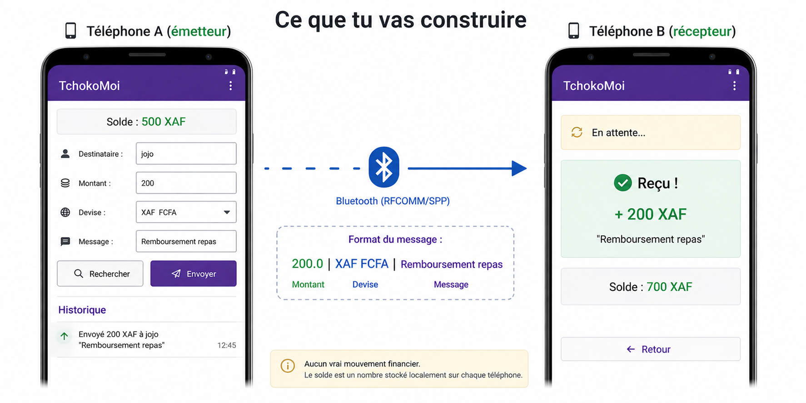

# TchokoMoi 💸

> *"Tchoko-moi" — argot camerounais pour "envoie-moi" ou "prête-moi"*

Application Android de transfert d'argent entre étudiants via Bluetooth.  
Projet pédagogique — TP encadré sur 3 jours.

---

## C'est quoi TchokoMoi ?

Tu as mangé avec un ami et il t'a avancé l'argent. Tu veux le rembourser direct, sans cash, sans Internet, juste avec vos deux téléphones côte à côte. **C'est TchokoMoi.**

L'application permet à deux téléphones Android de s'échanger un montant, une devise et un message via Bluetooth. Le solde de chaque utilisateur est géré localement sur son téléphone.

> ⚠️ **Aucun vrai mouvement financier.** Le solde est un nombre stocké sur le téléphone. Ce projet illustre les mécanismes techniques d'une telle application dans un contexte pédagogique.

---

## Ce que tu vas construire




---

## Stack technique

| Élément | Détail |
|---------|--------|
| Langage | Java |
| Plateforme | Android (API 21+) |
| Communication | Bluetooth classique — RFCOMM/SPP |
| Persistance | SharedPreferences |
| Navigation | Intent entre Activities |
| UI | XML Layouts — LinearLayout, ScrollView |

---

## Structure du projet

```
TchokoMoi/
├── app/src/main/
│   ├── AndroidManifest.xml
│   ├── java/com/tp/tchoko/
│   │   ├── MainActivity.java
│   │   ├── ReceptionActivity.java
│   │   └── BluetoothHelper.java
│   └── res/layout/
│       ├── activity_main.xml
│       └── activity_reception.xml
├── TP/
│   ├── Jour1/CONSIGNES.md     ← Interface utilisateur
│   ├── Jour2/CONSIGNES.md     ← Persistance & Navigation  (à venir)
│   └── Jour3/CONSIGNES.md     ← Bluetooth réel            (à venir)
└── README.md
```

---

## Format du message Bluetooth

```
"200.0|XAF FCFA|Remboursement repas"
  └───┘ └──────┘ └─────────────────┘
  montant  devise      message
```

---

## Notions couvertes

| Jour | Thème | Notions |
|------|-------|---------|
| **Jour 1** | Interface | `LinearLayout`, `ScrollView`, `EditText`, `Spinner`, `ListView`, `Toast`, `AlertDialog` |
| **Jour 2** | Persistance | `SharedPreferences`, cycle de vie, `Intent`, 2e Activity |
| **Jour 3** | Bluetooth | `BluetoothAdapter`, `Thread`, socket RFCOMM, `InputStream/OutputStream` |

---

## Accès aux solutions

> 🔒 La branche `solution` sera activée par l'enseignant **après la fin du Jour 3.**

```bash
git checkout solution   # disponible après le TP
```

---

## Sécurité — Ce qui manque volontairement

| Manquant | Pourquoi c'est important |
|----------|--------------------------|
| Authentification (PIN/biométrie) | N'importe qui avec le téléphone peut envoyer |
| Chiffrement AES du message | Le texte Bluetooth transite en clair |
| Serveur central | Chaque solde est local, non synchronisé |
| Accusé de réception | Pas de confirmation que B a bien reçu |

Ces points sont discutés pendant les 3 jours.

---

*github.com/joelyk/tchokoMoi*
