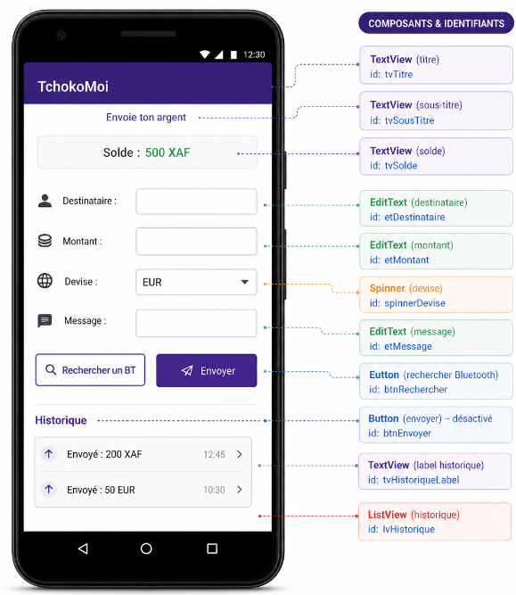
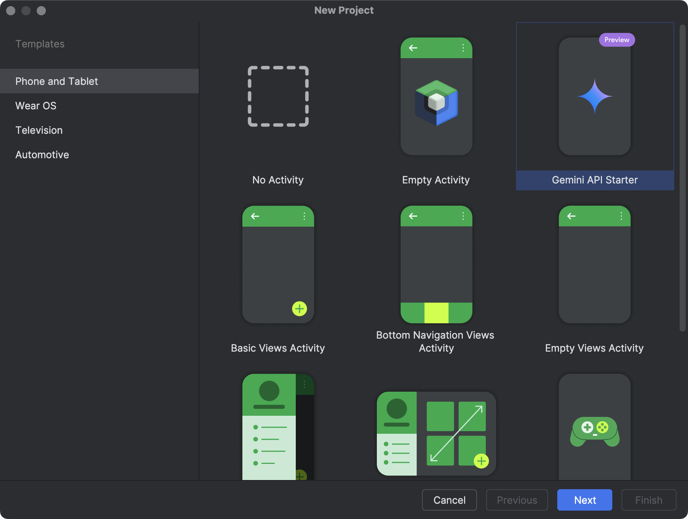
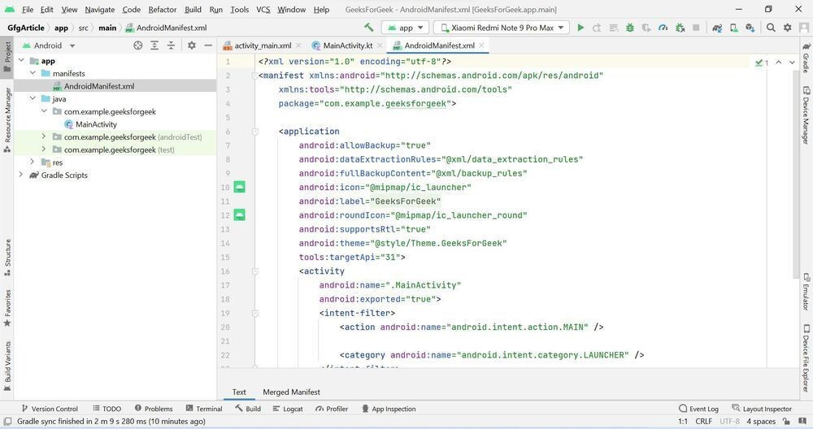
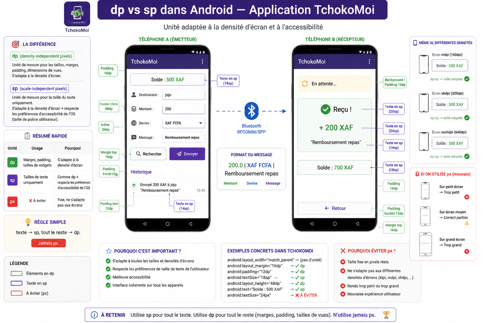
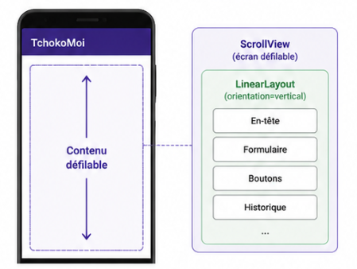

# TchokoMoi — Jour 1
## Interface utilisateur : Layouts & Widgets

> **Dépôt :** https://github.com/joelyk/tchokoMoi  
> **Durée :** 4 heures  
> **Solutions :** branche `solution` — accessible après le TP uniquement 🔒

---

## Objectif du jour

À la fin de cette séance, ton application doit ressembler à ceci :



---

## 0. Création du projet

### Étapes dans Android Studio

1. `File` → `New` → `New Project`
2. Sélectionner **Empty Activity**
3. Remplir :
   - **Name :** `TchokoMoi`
   - **Package :** `com.tp.tchoko`
   - **Language :** `Java`
   - **Minimum SDK :** `API 21`
4. Cliquer **Finish** et attendre la synchronisation Gradle



> 💡 **Empty Activity** crée exactement deux fichiers : `MainActivity.java` et `activity_main.xml`. C'est tout ce dont on a besoin pour commencer.

---

### Permissions dans `AndroidManifest.xml`

Ouvrir `app/manifests/AndroidManifest.xml` et ajouter **avant** la balise `<application>` :

```xml
<uses-permission android:name="android.permission.BLUETOOTH"/>
<uses-permission android:name="android.permission.BLUETOOTH_ADMIN"/>
<uses-permission android:name="android.permission.BLUETOOTH_CONNECT"/>
<uses-permission android:name="android.permission.BLUETOOTH_SCAN"/>
<uses-permission android:name="android.permission.ACCESS_FINE_LOCATION"/>
```



> 💡 Le `AndroidManifest.xml` est le **passeport** de ton application. Il dit au système Android ce que l'app peut faire, comment elle s'appelle, quelles permissions elle nécessite.

---

## Étape 1 — Layout XML : `activity_main.xml`

### Pourquoi XML pour l'interface ?

Android sépare l'interface (XML) du comportement (Java). L'avantage : on peut modifier l'UI sans toucher au code Java, et vice-versa.

### Les unités de mesure

Avant de coder, un point essentiel sur les unités :



| Unité | Usage | Pourquoi |
|-------|-------|----------|
| `dp` | Marges, padding, tailles de widgets | S'adapte à la densité d'écran |
| `sp` | Tailles de texte uniquement | Comme `dp` + respecte les préférences d'accessibilité de l'OS |
| `px` | ❌ À éviter | Fixe, ne s'adapte pas aux écrans |

> **Règle simple :** texte → `sp`, tout le reste → `dp`. Jamais `px`.

> 🎥 **Recommandation vidéo** — Pour bien comprendre dp, sp et la densité d'écran avant de coder, regarde cette vidéo :  
> [Android UI — dp, sp, px expliqués](https://www.youtube.com/watch?v=3tzEcB-GOKI)

---

### 1a. Structure racine — `ScrollView` + `LinearLayout`

Un `LinearLayout` place ses enfants **les uns après les autres** (verticalement ou horizontalement). On l'entoure d'un `ScrollView` pour que la page soit scrollable sur les petits écrans.



Ouvrir `res/layout/activity_main.xml`, passer en mode **Code** et remplacer tout le contenu par :

```xml
<?xml version="1.0" encoding="utf-8"?>
<ScrollView
    xmlns:android="http://schemas.android.com/apk/res/android"
    android:layout_width="match_parent"
    android:layout_height="match_parent"
    android:background="#F8F9FA">

    <LinearLayout
        android:layout_width="match_parent"
        android:layout_height="wrap_content"
        android:orientation="vertical"
        android:padding="16dp">

        <!-- ↓ Les widgets vont s'ajouter ici ↓ -->

    </LinearLayout>
</ScrollView>
```

---

### 1b. En-tête et solde

À l'intérieur du `LinearLayout`, ajouter :

```xml
<!-- Titre -->
<TextView
    android:id="@+id/tvTitle"
    android:layout_width="match_parent"
    android:layout_height="wrap_content"
    android:text="TchokoMoi"
    android:textSize="28sp"
    android:textStyle="bold"
    android:gravity="center"
    android:textColor="#D35400"
    android:layout_marginBottom="8dp"/>

<!-- Sous-titre -->
<TextView
    android:layout_width="match_parent"
    android:layout_height="wrap_content"
    android:text="Envoie ton argent à un ami"
    android:textSize="14sp"
    android:gravity="center"
    android:textColor="#666666"
    android:layout_marginBottom="24dp"/>

<!-- Solde -->
<TextView
    android:id="@+id/tvSolde"
    android:layout_width="match_parent"
    android:layout_height="wrap_content"
    android:text="Solde : 500,00 XAF"
    android:textSize="20sp"
    android:textStyle="bold"
    android:gravity="center"
    android:textColor="#1E8449"
    android:layout_marginBottom="24dp"/>
```

---

### 🟢 Exercice 1

**Sans regarder l'indice**, réponds à ces questions dans un commentaire dans ton XML ou sur ta feuille :

**1.** Quelle est la différence entre `android:gravity="center"` et `android:layout_gravity="center"` ?

**2.** Pourquoi le `tvSolde` a-t-il un `id` mais pas le sous-titre ?

**3.** Change la couleur du titre en `#27AE60` (vert). Dans quel attribut exact fais-tu la modification ?

<details>
<summary>💡 Indice</summary>

- `gravity` = aligne le **contenu** à l'intérieur du widget (le texte dans la boîte)
- `layout_gravity` = positionne **le widget** dans son parent (la boîte dans le conteneur)
- On donne un `id` uniquement aux vues qu'on va manipuler depuis le code Java avec `findViewById()`
- La couleur → attribut `android:textColor`

</details>

<details>
<summary>🔒 Solution complète</summary>

> Disponible après le TP → branche `solution` sur https://github.com/joelyk/tchokoMoi

</details>

---

### 1c. Formulaire de saisie

Ajouter sous le solde, toujours dans le `LinearLayout` :

```xml
<LinearLayout
    android:layout_width="match_parent"
    android:layout_height="wrap_content"
    android:orientation="vertical"
    android:background="#FFFFFF"
    android:padding="16dp"
    android:layout_marginBottom="16dp">

    <!-- Champ destinataire -->
    <TextView
        android:layout_width="wrap_content"
        android:layout_height="wrap_content"
        android:text="Destinataire"
        android:textStyle="bold"
        android:layout_marginBottom="6dp"/>

    <!-- ============================================ -->
    <!--  TODO — Exercice 2 : ajouter etDestinataire  -->
    <!-- ============================================ -->

    <!-- Champ montant -->
    <TextView
        android:layout_width="wrap_content"
        android:layout_height="wrap_content"
        android:text="Montant à envoyer"
        android:textStyle="bold"
        android:layout_marginBottom="6dp"/>

    <EditText
        android:id="@+id/etMontant"
        android:layout_width="match_parent"
        android:layout_height="wrap_content"
        android:hint="Ex : 500"
        android:inputType="numberDecimal"
        android:layout_marginBottom="16dp"/>

    <!-- Devise -->
    <TextView
        android:layout_width="wrap_content"
        android:layout_height="wrap_content"
        android:text="Devise"
        android:textStyle="bold"
        android:layout_marginBottom="6dp"/>

    <Spinner
        android:id="@+id/spinnerDevise"
        android:layout_width="match_parent"
        android:layout_height="wrap_content"
        android:layout_marginBottom="16dp"/>

    <!-- Message -->
    <TextView
        android:layout_width="wrap_content"
        android:layout_height="wrap_content"
        android:text="Message (optionnel)"
        android:textStyle="bold"
        android:layout_marginBottom="6dp"/>

    <EditText
        android:id="@+id/etMessage"
        android:layout_width="match_parent"
        android:layout_height="wrap_content"
        android:hint="Ex : Remboursement repas"
        android:inputType="text"/>

</LinearLayout>
```

---

### 🟢 Exercice 2

**Compléter le `TODO`** : ajouter le champ `etDestinataire` dans le formulaire.

Contraintes :
- `id` = `etDestinataire`
- `hint` = `"Ex : Kouam Jean"`
- Le clavier affiché doit être un clavier texte normal
- Ajouter une marge basse de `16dp`

```xml
<!-- Écris ton XML ici -->


```

**Pourquoi utilise-t-on `inputType="numberDecimal"` pour le montant et pas `inputType="text"` ?**

```
Ta réponse :
```

<details>
<summary>💡 Indice</summary>

- Un `EditText` texte simple : `android:inputType="textPersonName"` ou juste `"text"`
- `numberDecimal` → clavier numérique direct sur mobile + empêche les lettres → meilleure UX ET protection implicite contre les erreurs de saisie

</details>

<details>
<summary>🔒 Solution complète</summary>

> Disponible après le TP → branche `solution` sur https://github.com/joelyk/tchokoMoi

</details>

---

### 1d. Boutons et historique

```xml
<!-- Bouton recherche Bluetooth -->
<Button
    android:id="@+id/btnRechercher"
    android:layout_width="match_parent"
    android:layout_height="wrap_content"
    android:text="Rechercher un appareil"
    android:layout_marginBottom="8dp"/>

<!-- Bouton envoyer — désactivé par défaut -->
<Button
    android:id="@+id/btnEnvoyer"
    android:layout_width="match_parent"
    android:layout_height="wrap_content"
    android:text="Envoyer"
    android:enabled="false"
    android:layout_marginBottom="24dp"/>

<!-- Label historique -->
<TextView
    android:layout_width="wrap_content"
    android:layout_height="wrap_content"
    android:text="Historique des transferts"
    android:textStyle="bold"
    android:textSize="16sp"
    android:layout_marginBottom="8dp"/>

<!-- Liste des transactions -->
<ListView
    android:id="@+id/lvHistorique"
    android:layout_width="match_parent"
    android:layout_height="300dp"/>
```

> 💡 `android:enabled="false"` grise le bouton et le rend non cliquable. On l'activera en Java (`btnEnvoyer.setEnabled(true)`) uniquement après une connexion Bluetooth réussie — **Jour 3**.

---

## Étape 2 — Code Java : `MainActivity.java`

### 2a. Déclarations et `onCreate()`

Ouvrir `MainActivity.java`. La structure de base :

```java
public class MainActivity extends AppCompatActivity {

    // --- Widgets ---
    private TextView tvSolde;
    private EditText etMontant, etMessage, etDestinataire;
    private Spinner  spinnerDevise;
    private Button   btnEnvoyer, btnRechercher;
    private ListView lvHistorique;

    // --- Données ---
    private double solde = 500.00;
    private ArrayAdapter<String> historiqueAdapter;
    private ArrayList<String>   listeHistorique = new ArrayList<>();

    @Override
    protected void onCreate(Bundle savedInstanceState) {
        super.onCreate(savedInstanceState);
        setContentView(R.layout.activity_main);

        // 1. Lier les vues
        tvSolde        = findViewById(R.id.tvSolde);
        etMontant      = findViewById(R.id.etMontant);
        etMessage      = findViewById(R.id.etMessage);
        spinnerDevise  = findViewById(R.id.spinnerDevise);
        btnEnvoyer     = findViewById(R.id.btnEnvoyer);
        btnRechercher  = findViewById(R.id.btnRechercher);
        lvHistorique   = findViewById(R.id.lvHistorique);

        // TODO — Exercice 2 : après avoir ajouté etDestinataire dans le XML,
        // ajouter la ligne suivante :
        // etDestinataire = findViewById(R.id.etDestinataire);

        // 2. Initialiser le Spinner
        // ==============================
        // TODO — Exercice 3a
        // ==============================

        // 3. Initialiser le ListView
        // ==============================
        // TODO — Exercice 3b
        // ==============================

        // 4. Gérer les clics
        // ==============================
        // TODO — Exercice 3c
        // ==============================
    }
}
```

---

### 🟢 Exercice 3

**3a.** Initialiser le `Spinner` avec les devises `["XAF FCFA", "EUR", "USD", "GBP"]` :

```java
String[] devises = { _______, _______, _______, _______ };

ArrayAdapter<String> deviseAdapter = new ArrayAdapter<>(
    _______,                                        // contexte
    android.R.layout.______________________,        // layout item
    _______                                         // données
);
spinnerDevise.setAdapter(_______);
```

**3b.** Initialiser le `ListView` avec un adaptateur vide :

```java
historiqueAdapter = new ArrayAdapter<>(
    _______,
    android.R.layout._______________________,
    _______
);
lvHistorique.setAdapter(_______);
```

**3c.** Ajouter un `OnClickListener` sur `btnRechercher` qui affiche un Toast `"Recherche Bluetooth..."` :

```java
btnRechercher.setOnClickListener(_______ -> {
    Toast.makeText(_______, _______, Toast.LENGTH_SHORT).show();
    btnEnvoyer.setEnabled(_______); // simuler connexion réussie
});

btnEnvoyer.setOnClickListener(_______ -> validerEtEnvoyer());
```

<details>
<summary>💡 Indices</summary>

- Spinner : `android.R.layout.simple_spinner_dropdown_item`
- ListView : `android.R.layout.simple_list_item_1`
- Toast : `Toast.makeText(this, "texte", Toast.LENGTH_SHORT).show()`
- Lambda listener : `v -> { ... }`

</details>

<details>
<summary>🔒 Solution complète</summary>

> Disponible après le TP → branche `solution` sur https://github.com/joelyk/tchokoMoi

</details>

---

### 2b. Validation et confirmation — `validerEtEnvoyer()`

```java
private void validerEtEnvoyer() {
    String montantStr = etMontant.getText().toString().trim();

    // Validation 1 — champ vide
    if (montantStr.isEmpty()) {
        Toast.makeText(this, "Saisis un montant !", Toast.LENGTH_SHORT).show();
        return;
    }

    double montant = Double.parseDouble(montantStr);
    String devise  = spinnerDevise.getSelectedItem().toString();
    String message = etMessage.getText().toString().trim();
    String nom     = etDestinataire.getText().toString().trim();

    // Validation 2 — montant négatif
    if (montant <= 0) {
        Toast.makeText(this, "Le montant doit être positif !", Toast.LENGTH_SHORT).show();
        return;
    }

    // Validation 3 — solde insuffisant
    if (montant > solde) {
        Toast.makeText(this, "Solde insuffisant !", Toast.LENGTH_LONG).show();
        return;
    }

    // ================================================
    // TODO — Exercice 4 : ajouter la Validation 4
    // Règle : montant max autorisé = 50 000
    // ================================================

    // Confirmation AlertDialog
    String titre = nom.isEmpty() ? "Confirmer le tchoko" : "Tchoko pour " + nom;

    new AlertDialog.Builder(this)
        .setTitle(titre)
        .setMessage("Envoyer " + (int)montant + " " + devise + " ?"
            + (message.isEmpty() ? "" : "\nMessage : " + message))
        .setPositiveButton("Envoyer", (d, w) -> effectuerTransfert(montant, devise, message))
        .setNegativeButton("Annuler", null)
        .show();
}
```

---

### 🟢 Exercice 4

**Compléter la Validation 4** (montant maximum 50 000) :

```java
// À placer après la Validation 3 :
if ( _______ ) {
    Toast.makeText(this, _______, Toast.LENGTH_LONG).show();
    return;
}
```

**Question bonus :** que se passerait-il si on ne mettait pas `return` après le `Toast` ?

```
Ta réponse :
```

<details>
<summary>💡 Indice</summary>

- Condition : `montant > 50000`
- Sans `return` : le code continue et lance quand même l'AlertDialog malgré la validation échouée

</details>

<details>
<summary>🔒 Solution complète</summary>

> Disponible après le TP → branche `solution` sur https://github.com/joelyk/tchokoMoi

</details>

---

### 2c. Effectuer le transfert — fourni complet

```java
private void effectuerTransfert(double montant, String devise, String message) {
    // Déduire du solde
    solde -= montant;
    tvSolde.setText(String.format("Solde : %.0f %s", solde, devise));

    // Ajouter à l'historique
    String entree = "Envoyé : " + (int)montant + " " + devise;
    if (!message.isEmpty()) entree += " — " + message;
    listeHistorique.add(0, entree);
    historiqueAdapter.notifyDataSetChanged();

    // Vider les champs
    etMontant.setText("");
    etMessage.setText("");

    Toast.makeText(this, "Tchoko envoyé ! 💸", Toast.LENGTH_LONG).show();
}
```

---

### 🟢 Exercice 5 — Test et réflexion

**Lance l'application** sur l'émulateur ou ton téléphone.

**1.** Envoie `200 XAF` avec le message `"Repas"`. Vérifie :
- [ ] Le solde affiche `300 XAF`
- [ ] L'historique affiche la ligne
- [ ] Le champ montant se vide

**2.** Tourne l'émulateur (rotation d'écran ou `Ctrl+F12`). Que se passe-t-il avec le solde ?

```
Ta réponse :
```

**3.** Pourquoi ce comportement ? Que faudrait-il pour le corriger ?

```
Ta réponse :
```

<details>
<summary>💡 Indice</summary>

La rotation détruit et recrée l'Activity — c'est le **cycle de vie Android**. La variable `solde` repart à `500.0`. La solution = `SharedPreferences` pour persister les données → **Jour 2 !**

</details>

<details>
<summary>🔒 Solution complète</summary>

> Disponible après le TP → branche `solution` sur https://github.com/joelyk/tchokoMoi

</details>

---

## Questions bilan — Jour 1

Réponds avant de quitter la séance :

| # | Question |
|---|----------|
| Q1 | Quelle différence entre `match_parent` et `wrap_content` ? |
| Q2 | Pourquoi `dp` pour les marges et `sp` pour le texte ? |
| Q3 | À quoi sert `findViewById()` ? Que retourne-t-il si l'id n'existe pas ? |
| Q4 | Pourquoi `btnEnvoyer` est désactivé au démarrage ? |
| Q5 | Que se passe-t-il avec le solde et l'historique si on ferme et relance l'app ? |

---

## Récap Jour 1

```
XML appris                 Java appris                  À venir
─────────────────────      ──────────────────────────   ────────────────
ScrollView                 findViewById()               SharedPreferences  (J2)
LinearLayout vertical      setOnClickListener           Intent / 2e Activity (J2)
match_parent / wrap        ArrayAdapter                 Bluetooth réel     (J3)
dp vs sp                   notifyDataSetChanged()
TextView / EditText        Toast
Button / Spinner           AlertDialog
ListView                   String.format()
android:enabled
```

---

*Suite → [Jour 2 : Persistance & Navigation](../Jour2/CONSIGNES.md)*
