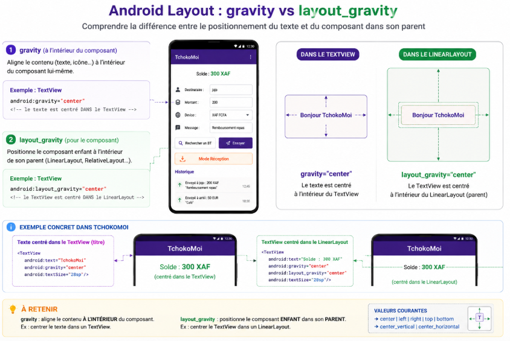

# TchokoMoi — Corrections Jour 1
## Solutions complètes + réponses aux questions de cours

> ⚠️ Ce document est distribué **après** la séance du Jour 1.  
> Branche `solution` maintenant accessible sur https://github.com/joelyk/tchokoMoi

---

## ✅ Exercice 1 — `gravity`, `layout_gravity` et les `id`

### 1. Différence entre `android:gravity` et `android:layout_gravity`

- **`android:gravity`** → aligne le **contenu à l'intérieur** du widget (le texte dans la boîte)
- **`android:layout_gravity`** → positionne **le widget lui-même** dans son parent (la boîte dans le conteneur)



### 2. Pourquoi `tvSolde` a un `id` mais pas le sous-titre ?

On donne un `id` **uniquement** aux vues qu'on va manipuler depuis Java avec `findViewById()`.

- Le **sous-titre** affiche toujours le même texte → aucun accès Java nécessaire → pas d'`id`
- **`tvSolde`** est mis à jour après chaque transfert : `tvSolde.setText(...)` → `id` obligatoire

Règle : pas d'`id` = moins de bruit dans le code et moins de risques de collision de noms.

### 3. Changer la couleur du titre

```xml
android:textColor="#27AE60"
```

---

## ✅ Exercice 2 — `etDestinataire` dans le XML

### XML à ajouter (à la place du TODO) :

```xml
<EditText
    android:id="@+id/etDestinataire"
    android:layout_width="match_parent"
    android:layout_height="wrap_content"
    android:hint="Ex : Kouam Jean"
    android:inputType="textPersonName"
    android:layout_marginBottom="16dp"/>
```

### Dans `MainActivity.java`, décommenter :

```java
etDestinataire = findViewById(R.id.etDestinataire);
```

### Dans `validerEtEnvoyer()`, remplacer la ligne temporaire :

```java
// Avant (temporaire) :
String nom = "";

// Après :
String nom = etDestinataire.getText().toString().trim();
```

### Pourquoi `inputType="numberDecimal"` pour le montant ?

- Affiche **directement** le clavier numérique → l'utilisateur ne bascule pas entre claviers
- Empêche implicitement la saisie de lettres → protection contre les erreurs de saisie
- Meilleure expérience utilisateur mobile

---

## ✅ Exercice 3 — Spinner, ListView, OnClickListeners

### 3a. Initialiser le Spinner

```java
String[] devises = { "XAF FCFA", "EUR", "USD", "GBP" };

ArrayAdapter<String> deviseAdapter = new ArrayAdapter<>(
    this,
    android.R.layout.simple_spinner_dropdown_item,
    devises
);
spinnerDevise.setAdapter(deviseAdapter);
```

### 3b. Initialiser le ListView

```java
historiqueAdapter = new ArrayAdapter<>(
    this,
    android.R.layout.simple_list_item_1,
    listeHistorique
);
lvHistorique.setAdapter(historiqueAdapter);
```

> 💡 On passe `listeHistorique` (la référence à l'objet ArrayList) à l'adaptateur. Quand on ajoute
> des éléments à `listeHistorique` plus tard, l'adaptateur "voit" les changements — il suffit
> d'appeler `notifyDataSetChanged()` pour rafraîchir l'affichage.

### 3c. OnClickListeners

```java
btnRechercher.setOnClickListener(v -> {
    Toast.makeText(this, "Recherche Bluetooth...", Toast.LENGTH_SHORT).show();
    btnEnvoyer.setEnabled(true); // simule une connexion réussie
});

btnEnvoyer.setOnClickListener(v -> validerEtEnvoyer());
```

> 💡 La syntaxe `v ->` est une **lambda Java 8**. Elle remplace l'ancienne syntaxe :
> ```java
> new View.OnClickListener() {
>     @Override
>     public void onClick(View v) { ... }
> }
> ```

---

## ✅ Exercice 4 — Validation 4 (montant maximum 50 000)

```java
// À placer après la Validation 3 :
if (montant > 50000) {
    Toast.makeText(this, "Montant maximum autorisé : 50 000", Toast.LENGTH_LONG).show();
    return;
}
```

### Que se passerait-il sans `return` ?

Sans `return`, l'exécution **continue** vers l'`AlertDialog`. L'utilisateur verrait simultanément le Toast d'erreur ET la boîte de confirmation → comportement incohérent.

Le `return` court-circuite immédiatement la méthode dès qu'une validation échoue. C'est le pattern **"fail fast"** : sortir tôt si quelque chose ne va pas.

---

## ✅ Exercice 5 — Test et rotation d'écran

### Ce qui se passe lors de la rotation

Le solde revient à 500 XAF et l'historique est effacé.

**Pourquoi ?** La rotation d'écran **détruit** l'Activity et en crée une nouvelle (Android doit reconstruire l'interface pour la nouvelle orientation). Toutes les variables Java (`solde`, `listeHistorique`) sont réinitialisées à leurs valeurs déclarées.

**Comment corriger ?** Stocker les données dans un espace qui survit à la destruction de l'Activity → **`SharedPreferences`** → c'est exactement l'objet du **Jour 2** !

---

## ✅ Questions bilan — Réponses complètes

### Q1 — Quelle différence entre `match_parent` et `wrap_content` ?

| | `match_parent` | `wrap_content` |
|--|----------------|----------------|
| Taille | Toute la place disponible dans le parent | Juste la taille du contenu |
| Exemple | Un bouton pleine largeur | Un TextView dont la largeur suit le texte |
| Risque | Peut prendre trop de place | Peut être trop petit si le contenu est grand |

### Q2 — Pourquoi `dp` pour les marges et `sp` pour le texte ?

- **`dp`** (density-independent pixel) : se redimensionne selon la densité d'écran → 16dp fait la même taille visuelle sur un téléphone bas de gamme et un flagship
- **`sp`** (scale-independent pixel) : comme `dp` + **respecte les préférences d'accessibilité** de l'OS (ex : un utilisateur malvoyant qui a augmenté la taille de la police système)

Utiliser `sp` pour les textes respecte les besoins des utilisateurs en situation de handicap visuel.

### Q3 — À quoi sert `findViewById()` ? Que retourne-t-il si l'id n'existe pas ?

`findViewById(R.id.xxx)` cherche une vue par son identifiant dans la hiérarchie XML de l'écran courant et retourne un objet `View` (qu'on caste en `TextView`, `Button`, etc.).

Si l'id n'existe pas (faute de frappe ou oubli dans le XML) → retourne **`null`**. Tout appel de méthode sur `null` provoque un crash : **`NullPointerException`**.

C'est pour ça qu'on appelle **toujours** `setContentView()` avant `findViewById()` : le XML doit être chargé pour qu'on puisse y chercher des vues.

### Q4 — Pourquoi `btnEnvoyer` est désactivé au démarrage ?

On ne peut pas envoyer de l'argent sans être connecté à un autre appareil via Bluetooth. Le bouton ne s'active qu'après une connexion Bluetooth établie (simulée aujourd'hui par `btnRechercher` ; réelle au Jour 3).

**Principe UX :** ne jamais exposer une action qui ne peut pas aboutir → évite la frustration et les erreurs.

### Q5 — Que se passe-t-il avec le solde et l'historique si on ferme et relance l'app ?

Tout est perdu : solde revient à 500 XAF, historique vide. Les variables Java vivent en **mémoire vive (RAM)**, libérée à la fermeture. Solution → `SharedPreferences` (Jour 2).

---

## 🔭 Ce qui arrive au Jour 2

```
Problème résolu demain    Notion                     Effet
──────────────────────    ─────────────────────────  ────────────────────────
Solde perdu               SharedPreferences          Solde survit à la fermeture
Historique perdu          onPause / onResume         Historique persist aussi
Un seul écran             Intent                     Nouveau bouton → 2ème écran
                          ReceptionActivity          Écran pour recevoir un tchoko
```

> 💡 Demain on touche au code **Java uniquement** — plus de XML (ou presque) !
```
