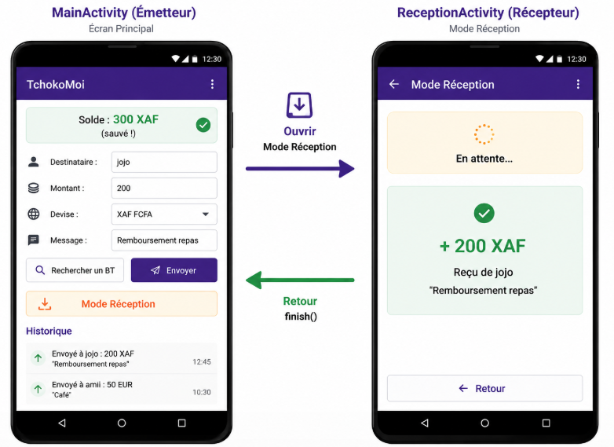
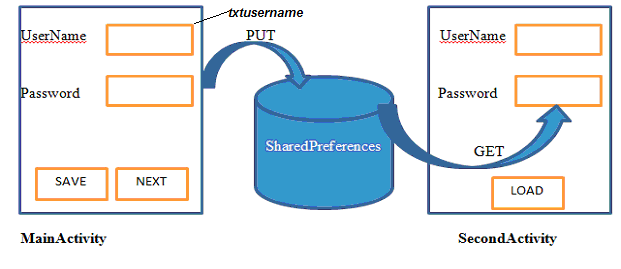
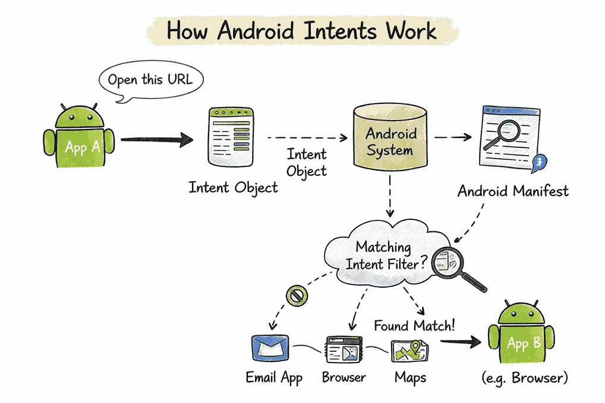
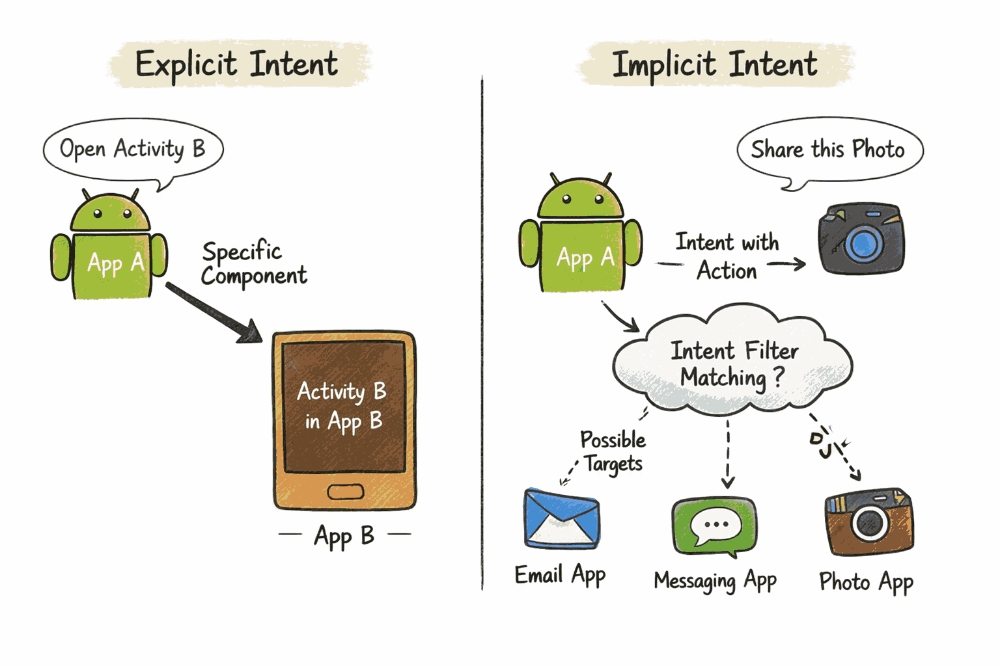

# TchokoMoi — Jour 2
## Persistance & Navigation

> **Dépôt :** https://github.com/joelyk/tchokoMoi  
> **Durée :** 4 heures  
> **Solutions :** branche `solution` — accessible après le TP uniquement 🔒

---

## Rappel du Jour 1

Tu as construit l'interface complète et la logique de transfert. Mais tu as observé un problème :

> 💬 *"Quand je tourne l'écran ou que je ferme l'app, le solde revient à 500 et l'historique disparaît."*

C'est exactement ce qu'on règle aujourd'hui.

---

## Objectif du jour

À la fin de cette séance, ton application doit :

- Conserver le solde et l'historique **même après rotation d'écran ou fermeture**
- Avoir **deux écrans** : envoi (MainActivity) et réception (ReceptionActivity)
- Permettre de naviguer entre les deux écrans avec un bouton



---

## Notions clés du jour

### SharedPreferences — le carnet de notes de l'app



`SharedPreferences` est un **fichier XML léger** géré par Android, idéal pour des petites données clé-valeur (préférences, scores, état...). Il survit à la fermeture de l'app, aux rotations d'écran, et aux redémarrages du téléphone.

```java
// ── Accéder au fichier de préférences ──────────────────────────
SharedPreferences prefs = getSharedPreferences("tchoko_prefs", MODE_PRIVATE);

// ── Écrire ─────────────────────────────────────────────────────
SharedPreferences.Editor editor = prefs.edit();
editor.putFloat("solde", 350.0f);
editor.putString("nom", "Joel");
editor.apply();        // asynchrone — ne bloque pas le thread UI

// ── Lire ───────────────────────────────────────────────────────
float solde = prefs.getFloat("solde", 500.0f); // 500.0f = valeur par défaut
String nom  = prefs.getString("nom", "");
```

| Type Java | Méthode d'écriture | Méthode de lecture |
|-----------|-------------------|-------------------|
| `float`   | `putFloat(clé, val)` | `getFloat(clé, défaut)` |
| `String`  | `putString(clé, val)` | `getString(clé, défaut)` |
| `boolean` | `putBoolean(clé, val)` | `getBoolean(clé, défaut)` |
| `int`     | `putInt(clé, val)` | `getInt(clé, défaut)` |

> ⚠️ `double` n'existe pas directement → convertir en `float` : `(float) monDouble`

---

### Cycle de vie d'une Activity


Quand tu utilises ton téléphone, Android crée et détruit les Activities en permanence. Voici les étapes clés :

```
onCreate()   →  onStart()  →  onResume()
                                  │
                           (utilisateur interagit)
                                  │
                             onPause()   ← écran perd le focus (rotation, autre app...)
                                  │
                             onStop()
                                  │
                             onDestroy() ← Activity détruite
```

**Les deux méthodes qui nous intéressent aujourd'hui :**

- **`onResume()`** → appelé à chaque fois que l'écran devient actif (création initiale, retour depuis une autre Activity, retour depuis la barre de notifications...) → idéal pour **charger** les données
- **`onPause()`** → appelé dès que l'Activity perd le focus (rotation, appui sur "Retour", autre app...) → idéal pour **sauvegarder** les données

---

### Intent — naviguer entre Activities

```java
// Lancer une nouvelle Activity
Intent intent = new Intent(this, ReceptionActivity.class);
startActivity(intent);

// Fermer l'Activity courante et revenir en arrière
finish();
```





Android gère une **pile d'Activities** (back stack). `startActivity()` empile, `finish()` (ou le bouton Retour) dépile.

---

## Étape 1 — SharedPreferences : persister le solde

### 1a. Préparer la constante

Dans `MainActivity.java`, ajouter juste après les déclarations de widgets :

```java
private static final String PREFS_NOM = "tchoko_prefs";
```

### 1b. Les méthodes de sauvegarde et chargement

On va créer deux méthodes privées. Voici leur squelette — à placer en bas de la classe, avant la dernière accolade `}` :

```java
private void sauvegarderDonnees() {
    SharedPreferences prefs = getSharedPreferences(PREFS_NOM, MODE_PRIVATE);
    SharedPreferences.Editor editor = prefs.edit();

    // ══════════════════════════════════════════════════
    // TODO — Exercice 1a : sauvegarder le solde
    // Clé : "solde" | le solde est un double → convertir en float
    // ══════════════════════════════════════════════════

    editor.apply();
}

private void chargerDonnees() {
    SharedPreferences prefs = getSharedPreferences(PREFS_NOM, MODE_PRIVATE);

    // ══════════════════════════════════════════════════
    // TODO — Exercice 1b : charger le solde
    // Clé : "solde" | Valeur par défaut : 500.0f
    // Ne pas oublier de mettre à jour tvSolde après la lecture
    // ══════════════════════════════════════════════════
}
```

---

### 🟢 Exercice 1 — Lire et écrire le solde

**1a.** Dans `sauvegarderDonnees()`, remplacer le TODO par la sauvegarde du solde :

```java
editor._______("solde", (float) _______);
```

**1b.** Dans `chargerDonnees()`, remplacer le TODO par le chargement :

```java
solde = prefs._______("solde", _______);
tvSolde.setText(String.format("Solde : %.0f XAF", solde));
```

**Question :** Pourquoi doit-on caster `solde` en `(float)` pour la sauvegarde ?

```
Ta réponse :
```

<details>
<summary>💡 Indice</summary>

- `SharedPreferences` ne supporte pas `double` directement → utiliser `float`
- Cast : `(float) solde` → convertit le `double` en `float` (légère perte de précision, acceptable pour un solde affiché sans décimales)
- Lecture : `prefs.getFloat("solde", 500.0f)` retourne `500.0f` si la clé n'existe pas encore (première ouverture)

</details>

<details>
<summary>🔒 Solution complète</summary>

> Disponible après le TP → branche `solution` sur https://github.com/joelyk/tchokoMoi

</details>

---

## Étape 2 — Persister l'historique

### Le problème : ArrayList ne rentre pas dans SharedPreferences

`SharedPreferences` n'accepte que les types primitifs et `String`. Il faut **sérialiser** la liste en chaîne de caractères.

```
["Envoyé : 200 XAF", "Envoyé : 50 EUR", "Envoyé : 100 USD"]
              ↓  String.join("||", liste)
"Envoyé : 200 XAF||Envoyé : 50 EUR||Envoyé : 100 USD"
              ↓  stocké dans SharedPreferences
              ↓  "texte||texte||texte".split("\\|\\|")
["Envoyé : 200 XAF", "Envoyé : 50 EUR", "Envoyé : 100 USD"]
```

> Le séparateur `||` est choisi car il n'apparaît jamais dans un message normal. Un simple `|` ou `,` pourrait se retrouver dans le texte d'un message.

---

### 🟢 Exercice 2 — Sauvegarder et charger l'historique

**2a.** Dans `sauvegarderDonnees()`, ajouter **après** la sauvegarde du solde :

```java
// ══════════════════════════════════════════════════
// TODO — Exercice 2a : sauvegarder listeHistorique
// Joindre les éléments avec "||" → String.join("||", listeHistorique)
// Clé : "historique"
// ══════════════════════════════════════════════════
```

**2b.** Dans `chargerDonnees()`, ajouter **après** le chargement du solde :

```java
// ══════════════════════════════════════════════════
// TODO — Exercice 2b : charger listeHistorique
// 1. Lire la String avec la clé "historique" (défaut : "")
// 2. Vider listeHistorique avec .clear()
// 3. Si la String n'est pas vide :
//    - split sur "\\|\\|"
//    - ajouter chaque partie à listeHistorique
// 4. Appeler historiqueAdapter.notifyDataSetChanged()
// ══════════════════════════════════════════════════
```

**Question :** Pourquoi faut-il appeler `listeHistorique.clear()` avant d'ajouter les éléments chargés ?

```
Ta réponse :
```

<details>
<summary>💡 Indice</summary>

```java
// Sauvegarde :
editor.putString("historique", String.join("||", listeHistorique));

// Chargement :
listeHistorique.clear();
String historiqueSave = prefs.getString("historique", "");
if (!historiqueSave.isEmpty()) {
    for (String ligne : historiqueSave.split("\\|\\|")) {
        listeHistorique.add(ligne);
    }
}
historiqueAdapter.notifyDataSetChanged();
```

Sans `clear()` : à chaque appel de `chargerDonnees()`, les éléments s'accumulent en double dans la liste.

</details>

<details>
<summary>🔒 Solution complète</summary>

> Disponible après le TP → branche `solution` sur https://github.com/joelyk/tchokoMoi

</details>

---

## Étape 3 — Brancher dans le cycle de vie

Les méthodes sont prêtes. Il faut maintenant les **appeler** aux bons moments du cycle de vie.

---

### 🟢 Exercice 3 — `onResume()` et `onPause()`

Ajouter ces deux méthodes dans `MainActivity.java`, entre `effectuerTransfert()` et la dernière `}` :

**3a.** `onResume()` — appelé à chaque fois que l'écran devient actif :

```java
@Override
protected void onResume() {
    _______._______();   // toujours appeler super EN PREMIER
    _______();           // charger les données sauvegardées
}
```

**3b.** `onPause()` — appelé dès que l'écran perd le focus :

```java
@Override
protected void onPause() {
    _______._______();   // toujours appeler super EN PREMIER
    _______();           // sauvegarder avant de partir
}
```

**3c. Test de validation :**
- [ ] Envoie 200 XAF → solde = 300
- [ ] Tourne l'écran → solde reste 300 ✓
- [ ] Appuie sur le bouton Accueil, relance l'app → solde toujours 300 ✓
- [ ] Ferme complètement et relance → solde et historique intacts ✓

**Question :** Pourquoi `onResume()` et non `onCreate()` pour appeler `chargerDonnees()` ?

```
Ta réponse :
```

<details>
<summary>💡 Indice</summary>

- `super.onResume()` / `super.onPause()` doit être appelé en premier — Android en a besoin pour gérer son propre état interne
- `onResume()` est appelé **aussi** lors du retour depuis ReceptionActivity → les données se rafraîchissent automatiquement
- `onCreate()` n'est appelé qu'une seule fois (création initiale) — si on revient de ReceptionActivity, `onCreate()` n'est PAS rappelé

</details>

<details>
<summary>🔒 Solution complète</summary>

> Disponible après le TP → branche `solution` sur https://github.com/joelyk/tchokoMoi

</details>

---

## Étape 4 — Layout de `ReceptionActivity`

Ouvrir `res/layout/activity_reception.xml`. Le squelette est en place (fond vert `#E8F5E9`, `LinearLayout` centré).

---

### 🟢 Exercice 4 — Construire `activity_reception.xml`

Ajouter ces 4 widgets à l'intérieur du `LinearLayout`, **dans cet ordre** :

| Widget | `id` | Texte initial | Style |
|--------|------|---------------|-------|
| `TextView` | `tvStatut` | `"En attente de transfert..."` | `textSize="18sp"`, `gravity="center"`, `layout_marginBottom="32dp"` |
| `TextView` | `tvMontantRecu` | `""` (vide) | `textSize="48sp"`, `textStyle="bold"`, `textColor="#1E8449"`, `gravity="center"` |
| `TextView` | `tvMessageRecu` | `""` (vide) | `textSize="16sp"`, `textStyle="italic"`, `textColor="#666666"`, `gravity="center"`, `layout_marginTop="8dp"` |
| `Button` | `btnRetour` | `"← Retour"` | `layout_marginTop="48dp"`, `layout_width="match_parent"` |

```xml
<!-- Exemple pour tvStatut : -->
<TextView
    android:id="@+id/tvStatut"
    android:layout_width="match_parent"
    android:layout_height="wrap_content"
    android:text="En attente de transfert..."
    android:textSize="18sp"
    android:gravity="center"
    android:layout_marginBottom="32dp"/>

<!-- TODO — Exercice 4 : ajouter tvMontantRecu, tvMessageRecu, btnRetour -->
```

<details>
<summary>💡 Indice — XML complet de tvMontantRecu</summary>

```xml
<TextView
    android:id="@+id/tvMontantRecu"
    android:layout_width="match_parent"
    android:layout_height="wrap_content"
    android:text=""
    android:textSize="48sp"
    android:textStyle="bold"
    android:textColor="#1E8449"
    android:gravity="center"/>
```

</details>

<details>
<summary>🔒 Solution complète</summary>

> Disponible après le TP → branche `solution` sur https://github.com/joelyk/tchokoMoi

</details>

---

## Étape 5 — Ajouter le bouton "Mode Réception" dans MainActivity

### 5a. Dans `activity_main.xml`

Ajouter ce bouton **entre** `btnEnvoyer` et le `TextView` "Historique des transferts" :

```xml
<!-- Bouton mode réception -->
<Button
    android:id="@+id/btnReception"
    android:layout_width="match_parent"
    android:layout_height="wrap_content"
    android:text="Mode Réception 📥"
    android:backgroundTint="#1E8449"
    android:layout_marginBottom="16dp"/>
```

### 5b. Dans `MainActivity.java`

Ajouter la déclaration avec les autres boutons :

```java
private Button btnEnvoyer, btnRechercher, btnReception;
```

Dans `onCreate()`, lier la vue (après les autres `findViewById`) :

```java
btnReception = findViewById(R.id.btnReception);
```

---

### 🟢 Exercice 5 — Intent vers ReceptionActivity

**Compléter le `OnClickListener` dans `onCreate()` :**

```java
// ══════════════════════════════════════════════════
// TODO — Exercice 5 : lancer ReceptionActivity
// ══════════════════════════════════════════════════
btnReception.setOnClickListener(_______ -> {
    Intent intent = new Intent(_______, _______);
    _______(_______);
});
```

**Import à ajouter en haut du fichier :**
```java
import android.content.Intent;
```

**Question :** Pourquoi écrit-on `ReceptionActivity.class` et pas `new ReceptionActivity()` ?

```
Ta réponse :
```

<details>
<summary>💡 Indice</summary>

```java
btnReception.setOnClickListener(v -> {
    Intent intent = new Intent(this, ReceptionActivity.class);
    startActivity(intent);
});
```

- `this` = contexte de l'Activity courante (nécessaire pour créer un Intent)
- `ReceptionActivity.class` = la **classe** à lancer (pas une instance — Android crée lui-même l'instance)
- `startActivity()` empile la nouvelle Activity dans la back stack

</details>

<details>
<summary>🔒 Solution complète</summary>

> Disponible après le TP → branche `solution` sur https://github.com/joelyk/tchokoMoi

</details>

---

## Étape 6 — `ReceptionActivity.java`

Le layout est prêt. Il faut maintenant compléter le code Java.

---

### 🟢 Exercice 6 — Compléter `ReceptionActivity`

Voici la structure à écrire dans `ReceptionActivity.java` :

```java
public class ReceptionActivity extends AppCompatActivity {

    // ══════════════════════════════════════════════════
    // TODO — Exercice 6a : déclarer les 4 widgets
    // private TextView tvStatut, tvMontantRecu, tvMessageRecu;
    // private Button btnRetour;
    // ══════════════════════════════════════════════════

    @Override
    protected void onCreate(Bundle savedInstanceState) {
        super.onCreate(savedInstanceState);
        setContentView(R.layout.activity_reception);

        // ══════════════════════════════════════════════════
        // TODO — Exercice 6b : lier les 4 vues avec findViewById
        // ══════════════════════════════════════════════════

        // ══════════════════════════════════════════════════
        // TODO — Exercice 6c : btnRetour → finish()
        // finish() ferme cette Activity et revient à MainActivity
        // ══════════════════════════════════════════════════
    }
}
```

**Ajouter les imports nécessaires en haut du fichier :**

```java
import android.widget.Button;
import android.widget.TextView;
```

**Question :** Quelle est la différence entre `finish()` et `startActivity(new Intent(this, MainActivity.class))` pour "revenir" à l'écran précédent ?

```
Ta réponse :
```

<details>
<summary>💡 Indice</summary>

```java
// 6a — Déclarations
private TextView tvStatut, tvMontantRecu, tvMessageRecu;
private Button   btnRetour;

// 6b — Lier les vues
tvStatut      = findViewById(R.id.tvStatut);
tvMontantRecu = findViewById(R.id.tvMontantRecu);
tvMessageRecu = findViewById(R.id.tvMessageRecu);
btnRetour     = findViewById(R.id.btnRetour);

// 6c — Bouton retour
btnRetour.setOnClickListener(v -> finish());
```

`finish()` = dépile l'Activity courante → retour au contexte précédent sans créer de nouvelle instance.  
`startActivity(MainActivity.class)` = crée une **nouvelle** instance de MainActivity par-dessus → double la pile et peut dupliquer l'état.

</details>

<details>
<summary>🔒 Solution complète</summary>

> Disponible après le TP → branche `solution` sur https://github.com/joelyk/tchokoMoi

</details>

---

## 🛡️ Mini-cours Sécurité — Persistance locale

| Risque | Dans TchokoMoi | Bonne pratique |
|--------|---------------|----------------|
| Données en clair | Solde et historique lisibles dans le fichier XML des prefs | En production : utiliser `EncryptedSharedPreferences` (Jetpack Security) |
| `MODE_WORLD_READABLE` | On utilise `MODE_PRIVATE` ✅ | Ne jamais utiliser `MODE_WORLD_READABLE` — déprécié API 17, faille de sécurité |
| Accumulation illimitée | L'historique grandit sans limite | Limiter aux N dernières transactions ; ajouter un bouton "Effacer l'historique" |
| Données après désinstallation | Les prefs sont supprimées à la désinstallation | Normal et attendu — c'est un comportement correct |

> 💡 `SharedPreferences` est **stocké sur le stockage interne** de l'app, inaccessible aux autres apps (sauf root). C'est suffisant pour des données non critiques. Pour des mots de passe ou tokens : **Android Keystore** uniquement.

---

## Questions bilan — Jour 2

| # | Question |
|---|----------|
| Q1 | Quelle différence entre `editor.apply()` et `editor.commit()` ? Lequel préférer et pourquoi ? |
| Q2 | Pourquoi utilise-t-on `onResume()` plutôt que `onCreate()` pour charger les données ? |
| Q3 | À quoi sert `finish()` ? Quelle différence avec le bouton Retour physique ? |
| Q4 | Cite 2 types de données qui NE doivent PAS être stockés dans SharedPreferences en production. |
| Q5 | Qu'est-ce que la "back stack" (pile d'Activities) ? Que se passe-t-il si on appelle `startActivity()` sans jamais appeler `finish()` ? |

---

## Récap Jour 2

```
Java appris                  Concepts                      À venir
───────────────────────────  ────────────────────────────  ──────────────────────────
SharedPreferences            Cycle de vie Activity         BluetoothAdapter      (J3)
getSharedPreferences()       onPause → sauvegarder         BluetoothDevice       (J3)
editor.putFloat/String       onResume → charger            BluetoothSocket       (J3)
editor.apply()               Back stack (pile Activities)  Thread secondaire     (J3)
onPause() / onResume()       MODE_PRIVATE                  runOnUiThread         (J3)
Intent + startActivity()     Sérialisation String
finish()                     EncryptedSharedPreferences
String.join() / split()
```

---

*Suite → [Jour 3 : Bluetooth](../Jour3/CONSIGNES.md)*
