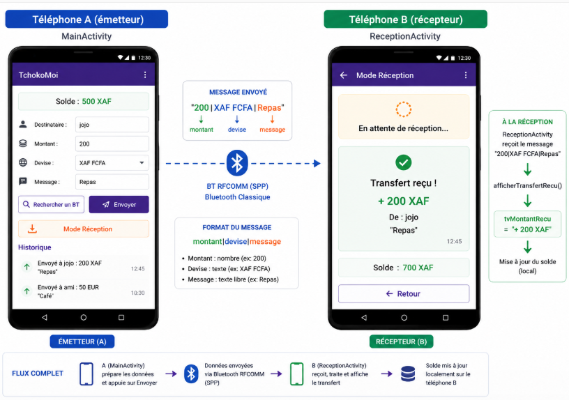
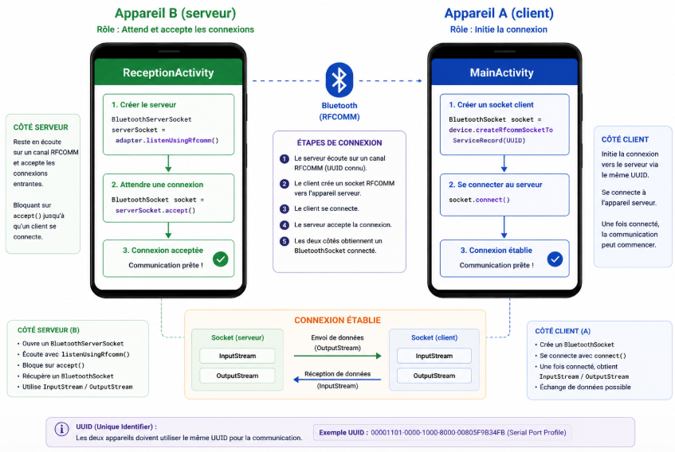

# TchokoMoi — Jour 3
## Bluetooth réel

> **Dépôt :** https://github.com/joelyk/tchokoMoi  
> **Durée :** 4 heures  
> **Solutions :** branche `solution` — accessible après le TP uniquement 🔒

---

## Rappel du Jour 2

Tu as maintenant une app avec deux écrans et une persistance des données. Le bouton "Rechercher un appareil" affiche un simple Toast — pas de vrai Bluetooth. Aujourd'hui, on branche le vrai.

---

## Objectif du jour

À la fin de cette séance :
- L'app détecte les appareils Bluetooth associés
- Elle établit une vraie connexion RFCOMM entre deux téléphones
- L'envoi d'argent transite réellement via Bluetooth
- L'écran de réception affiche le transfert reçu en temps réel



---

## Notions clés du jour

### Le profil SPP — Serial Port Profile

Bluetooth classique (BR/EDR) simule un câble série entre deux appareils via le profil **SPP (Serial Port Profile)**. L'UUID standard SPP est :

```
00001101-0000-1000-8000-00805F9B34FB
```

C'est l'UUID déjà présent dans `BluetoothHelper.java`. Les deux appareils doivent utiliser le **même UUID** pour se connecter.

### Architecture : Client / Serveur



- Le **serveur** (récepteur) ouvre un `BluetoothServerSocket` et attend
- Le **client** (émetteur) crée un `BluetoothSocket` et se connecte
- Une fois connectés, les deux ont un `InputStream` et un `OutputStream`

### Règle absolue : Bluetooth ≠ Thread principal

Toutes les opérations Bluetooth bloquent le thread. Si on les appelle sur le thread UI → **ANR (App Not Responding)**. Elles doivent impérativement se faire dans un **Thread secondaire**.

```java
new Thread(() -> {
    // ici : connect(), accept(), read(), write()
}).start();

// Pour mettre à jour l'UI depuis ce thread :
runOnUiThread(() -> {
    tvStatut.setText("Connecté !");
});
```

---

## Étape 1 — `BluetoothHelper` : vérifications et appareils

Ouvrir `BluetoothHelper.java`. Le squelette est prêt avec les imports et les champs.

### 🟢 Exercice 1 — Méthodes de vérification

**1a.** Implémenter `isBluetoothDisponible()` — retourne `true` si l'appareil a un module BT :

```java
public boolean isBluetoothDisponible() {
    return _______ != null;
}
```

**1b.** Implémenter `isBluetoothActive()` — retourne `true` si le BT est activé :

```java
public boolean isBluetoothActive() {
    return _______ != null && _______.isEnabled();
}
```

**1c.** Implémenter `getAppareilsAssocies()` — retourne la liste des appareils déjà couplés :

```java
public Set<BluetoothDevice> getAppareilsAssocies() {
    if (_______ == null) return null;
    return _______._______();
}
```

<details>
<summary>💡 Indice</summary>

- `bluetoothAdapter` est le champ déclaré dans la classe
- `getBondedDevices()` retourne un `Set<BluetoothDevice>` des appareils associés (couplés)
- Un `Set` ne garantit pas l'ordre mais suffit pour notre usage

</details>

<details>
<summary>🔒 Solution complète</summary>

> Disponible après le TP → branche `solution` sur https://github.com/joelyk/tchokoMoi

</details>

---

## Étape 2 — `BluetoothHelper` : connexion côté client

### 🟢 Exercice 2 — `connecterA(BluetoothDevice device)`

Cette méthode est appelée quand l'utilisateur sélectionne un appareil. Elle crée le socket et établit la connexion.

```java
public void connecterA(BluetoothDevice device) throws IOException {
    // 1. Créer le socket RFCOMM avec l'UUID SPP
    bluetoothSocket = device._______(_______);

    // 2. Arrêter la découverte (économise la batterie et stabilise la connexion)
    bluetoothAdapter._______();

    // 3. Se connecter (BLOQUANT — à appeler dans un Thread !)
    bluetoothSocket._______();
}
```

**Pourquoi `cancelDiscovery()` avant `connect()` ?**

```
Ta réponse :
___________________________________________________________
```

<details>
<summary>💡 Indice</summary>

- `createRfcommSocketToServiceRecord(MY_UUID)` crée le socket avec l'UUID SPP
- `cancelDiscovery()` → la découverte BT consomme beaucoup de ressources et peut ralentir / faire échouer la connexion
- `connect()` est **bloquant** → ne jamais l'appeler sur le thread UI

</details>

<details>
<summary>🔒 Solution complète</summary>

> Disponible après le TP → branche `solution` sur https://github.com/joelyk/tchokoMoi

</details>

---

## Étape 3 — `BluetoothHelper` : envoi de données

### 🟢 Exercice 3 — `envoyer(String donnees)`

Format des données envoyées : `"montant|devise|message"`  
Exemple : `"200|XAF FCFA|Remboursement repas"`

```java
public void envoyer(String donnees) throws IOException {
    // Récupérer le flux de sortie du socket
    OutputStream out = bluetoothSocket._______();

    // Convertir la String en bytes et envoyer (ajouter \n comme délimiteur)
    out.write((_______ + "\n")._______());
}
```

<details>
<summary>💡 Indice</summary>

- `bluetoothSocket.getOutputStream()` → flux d'écriture
- `"texte".getBytes()` → convertit en tableau de bytes (encodage UTF-8 par défaut)
- Le `\n` sert de délimiteur pour que le récepteur sache où s'arrête le message

</details>

<details>
<summary>🔒 Solution complète</summary>

> Disponible après le TP → branche `solution` sur https://github.com/joelyk/tchokoMoi

</details>

---

## Étape 4 — `BluetoothHelper` : écoute côté serveur

### L'interface callback

Ajouter cette interface **dans** `BluetoothHelper.java`, avant les champs :

```java
public interface OnDonneesRecuesListener {
    void onDonneesRecues(String donnees);
}
```

### 🟢 Exercice 4 — `attendreConnexion(OnDonneesRecuesListener listener)`

Cette méthode tourne en arrière-plan et notifie via le callback quand des données arrivent.

```java
public void attendreConnexion(OnDonneesRecuesListener listener) {
    new _______(_______ -> {
        try {
            // 1. Ouvrir le ServerSocket en mode écoute
            serverSocket = bluetoothAdapter
                ._______("TchokoMoi", _______);

            // 2. Attendre une connexion entrante (BLOQUANT)
            bluetoothSocket = serverSocket._______();

            // 3. Lire les données en boucle
            InputStream in = bluetoothSocket.getInputStream();
            byte[] buffer = new byte[1024];
            int bytes;
            while ((bytes = in.read(buffer)) != -1) {
                String recu = new String(buffer, 0, bytes).trim();
                if (!recu.isEmpty()) {
                    listener.onDonneesRecues(recu);
                }
            }
        } catch (IOException e) {
            e.printStackTrace();
        }
    }).start();
}
```

<details>
<summary>💡 Indice</summary>

- `new Thread(runnable).start()` → lance le thread
- `listenUsingRfcommWithServiceRecord("TchokoMoi", MY_UUID)` → ouvre le ServerSocket
- `serverSocket.accept()` → bloque jusqu'à qu'un client se connecte
- `in.read(buffer)` → lit les bytes reçus, retourne -1 si connexion fermée

</details>

<details>
<summary>🔒 Solution complète</summary>

> Disponible après le TP → branche `solution` sur https://github.com/joelyk/tchokoMoi

</details>

---

## Étape 5 — `BluetoothHelper` : fermeture propre

### 🟢 Exercice 5 — `fermer()`

```java
public void fermer() {
    try {
        if (bluetoothSocket != null) _______._______();
        if (serverSocket   != null) _______._______();
    } catch (IOException e) {
        e.printStackTrace();
    }
}
```

**Pourquoi fermer dans un `try-catch` ?**

```
Ta réponse :
___________________________________________________________
```

<details>
<summary>💡 Indice</summary>

- `.close()` sur un socket peut lever `IOException` si la connexion est déjà perdue
- Ignorer l'exception ici est acceptable — on veut juste libérer les ressources

</details>

<details>
<summary>🔒 Solution complète</summary>

> Disponible après le TP → branche `solution` sur https://github.com/joelyk/tchokoMoi

</details>

---

## Étape 6 — Brancher dans `MainActivity`

### 6a. Déclarer et instancier

Dans `MainActivity.java`, ajouter après les déclarations de widgets :

```java
private BluetoothHelper bluetoothHelper = new BluetoothHelper();
```

### 6b. Vérification au démarrage

Dans `onCreate()`, après `chargerDonnees()`, ajouter :

```java
if (!bluetoothHelper.isBluetoothDisponible()) {
    Toast.makeText(this, "Bluetooth non supporté", Toast.LENGTH_LONG).show();
    finish();
    return;
}
if (!bluetoothHelper.isBluetoothActive()) {
    Intent enableBt = new Intent(BluetoothAdapter.ACTION_REQUEST_ENABLE);
    startActivityForResult(enableBt, 1);
}
```

**Import à ajouter :**
```java
import android.bluetooth.BluetoothAdapter;
```

### 🟢 Exercice 6 — Bouton "Rechercher" avec vrai Bluetooth

Remplacer le listener de `btnRechercher` par :

```java
btnRechercher.setOnClickListener(v -> {
    Set<BluetoothDevice> appareils = bluetoothHelper._______();

    if (appareils == null || appareils.isEmpty()) {
        Toast.makeText(this, "Aucun appareil associé. Va dans les paramètres BT.", Toast.LENGTH_LONG).show();
        return;
    }

    // Construire la liste des noms pour l'AlertDialog
    String[] noms = appareils.stream()
        .map(BluetoothDevice::getName)
        .toArray(String[]::new);
    BluetoothDevice[] liste = appareils.toArray(new BluetoothDevice[0]);

    new AlertDialog.Builder(this)
        .setTitle("Choisir un appareil")
        .setItems(noms, (dialog, which) -> {
            // ══════════════════════════════════════════════
            // TODO — Exercice 6 : se connecter dans un Thread
            // bluetoothHelper.connecterA(liste[which])
            // puis btnEnvoyer.setEnabled(true) sur runOnUiThread
            // ══════════════════════════════════════════════
        })
        .show();
});
```

**Imports à ajouter :**
```java
import android.bluetooth.BluetoothDevice;
import java.util.Set;
```

**Compléter le TODO — se connecter dans un Thread :**

```java
new Thread(() -> {
    try {
        bluetoothHelper.connecterA(_______[which]);
        runOnUiThread(() -> {
            btnEnvoyer.setEnabled(_______);
            Toast.makeText(this, "Connecté à " + _______[which].getName(), Toast.LENGTH_SHORT).show();
        });
    } catch (IOException e) {
        runOnUiThread(() ->
            Toast.makeText(this, "Échec connexion : " + e.getMessage(), Toast.LENGTH_LONG).show()
        );
    }
}).start();
```

<details>
<summary>💡 Indice</summary>

- `getAppareilsAssocies()` retourne le Set des appareils couplés
- La connexion doit être dans un `new Thread(() -> { ... }).start()`
- `runOnUiThread()` permet de modifier les widgets depuis un Thread secondaire
- En cas d'échec : `IOException` — toujours l'attraper

</details>

<details>
<summary>🔒 Solution complète</summary>

> Disponible après le TP → branche `solution` sur https://github.com/joelyk/tchokoMoi

</details>

---

## Étape 7 — Envoi Bluetooth réel

Dans `effectuerTransfert()`, remplacer le Toast final par l'envoi réel :

```java
// Remplacer :
Toast.makeText(this, "Tchoko envoyé ! 💸", Toast.LENGTH_LONG).show();

// Par :
String payload = (int)montant + "|" + devise + "|" + message;
new Thread(() -> {
    try {
        bluetoothHelper.envoyer(_______);
        runOnUiThread(() ->
            Toast.makeText(this, "Tchoko envoyé ! 💸", Toast.LENGTH_LONG).show()
        );
    } catch (IOException e) {
        runOnUiThread(() ->
            Toast.makeText(this, "Erreur envoi BT : " + e.getMessage(), Toast.LENGTH_LONG).show()
        );
    }
}).start();
```

---

## Étape 8 — Réception dans `ReceptionActivity`

### 🟢 Exercice 7 — Compléter `ReceptionActivity` pour la réception

Ajouter dans `ReceptionActivity.java` :

```java
private BluetoothHelper bluetoothHelper = new BluetoothHelper();
```

Dans `onCreate()`, après avoir lié les vues, lancer l'écoute :

```java
bluetoothHelper.attendreConnexion(donnees -> {
    // donnees = "200|XAF FCFA|Remboursement repas"
    String[] parties = donnees.split("\\|");

    // ══════════════════════════════════════════════
    // TODO — Exercice 7 : parser et afficher sur le thread UI
    // Format : parties[0] = montant, parties[1] = devise, parties[2] = message
    // Utiliser runOnUiThread pour mettre à jour tvStatut, tvMontantRecu, tvMessageRecu
    // ══════════════════════════════════════════════
});
```

**Compléter le TODO :**

```java
runOnUiThread(() -> {
    tvStatut.setText("Transfert reçu !");
    tvMontantRecu.setText("+ " + _______ + " " + _______);
    tvMessageRecu.setText(parties.length > 2 ? _______ : "");
});
```

**Fermer proprement dans `onDestroy()` :**

```java
@Override
protected void onDestroy() {
    super.onDestroy();
    bluetoothHelper.fermer();
}
```

<details>
<summary>💡 Indice</summary>

- `parties[0]` = montant, `parties[1]` = devise, `parties[2]` = message (peut être absent)
- `runOnUiThread(() -> { ... })` est **obligatoire** pour modifier des widgets depuis un Thread secondaire
- `onDestroy()` = bonne méthode pour libérer les ressources réseau/BT

</details>

<details>
<summary>🔒 Solution complète</summary>

> Disponible après le TP → branche `solution` sur https://github.com/joelyk/tchokoMoi

</details>

---

## 🛡️ Mini-cours Sécurité — Bluetooth

| Risque | Dans TchokoMoi | Bonne pratique |
|--------|---------------|----------------|
| Données en clair | Le payload `"200\|XAF\|Repas"` est lisible par tout sniffer BT | En prod : chiffrer avec AES avant d'envoyer |
| Pas d'authentification | N'importe quel appareil couplé peut envoyer des données | Ajouter un code secret partagé dans le payload |
| Attaque MITM | Un 3ème appareil peut s'interposer | BLE avec chiffrement ou TLS over BT |
| Couplage non sécurisé | Le couplage "Just Works" (sans PIN) est vulnérable | Utiliser le couplage avec confirmation numérique |

> **Message clé :** TchokoMoi est un TP pédagogique. Une vraie app financière ne ferait jamais transiter d'argent via Bluetooth sans un serveur de validation centralisé et un chiffrement de bout en bout.

---

## Questions bilan — Jour 3

| # | Question |
|---|----------|
| Q1 | Pourquoi toutes les opérations Bluetooth doivent-elles se faire dans un Thread secondaire ? |
| Q2 | Qu'est-ce que le profil SPP ? Quel est l'UUID utilisé dans TchokoMoi ? |
| Q3 | Quelle est la différence entre `BluetoothSocket` et `BluetoothServerSocket` ? |
| Q4 | À quoi sert `runOnUiThread()` ? Que se passe-t-il si on modifie un widget depuis un Thread secondaire sans l'utiliser ? |
| Q5 | Cite une différence entre Bluetooth classique (BR/EDR) et BLE (Bluetooth Low Energy). |

---

## Récap Jour 3

```
BluetoothHelper          MainActivity (J3)          ReceptionActivity (J3)
───────────────────────  ────────────────────────   ─────────────────────────
BluetoothAdapter         bluetoothHelper.init()     attendreConnexion()
BluetoothDevice          getAppareilsAssocies()     Thread secondaire
BluetoothSocket          connecterA() → Thread      runOnUiThread()
BluetoothServerSocket    envoyer() → Thread         onDestroy() → fermer()
InputStream/OutputStream AlertDialog appareils      Parser "a|b|c"
UUID SPP                 ACTION_REQUEST_ENABLE
fermer() / onDestroy()   IOException → catch
```

---

*Félicitations — TchokoMoi est complet ! 🎉*  
*Branche `solution` débloquée sur https://github.com/joelyk/tchokoMoi*
